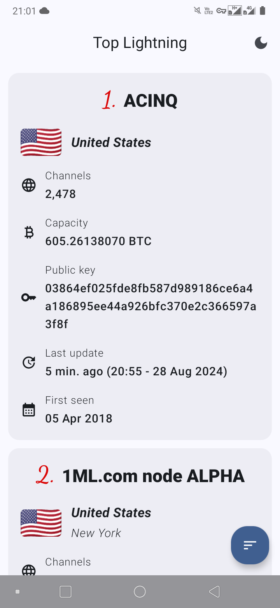

  

<h1 align="center">
  Top Lightning
</h1>

  
  
  

# About

Project created for a challenge, consuming the [Mempool API](https://mempool.space/docs/api/rest#get-top-100-nodes-connectivity) to get the top 100 best connected nodes of the lightning network.

The project follows the most common architecture and library recommendations for Android development using **Jetpack Compose**. The general architecture is based on the [architecture guide](https://developer.android.com/topic/architecture) and **MVI**.

## :memo: Features

In addition to what was requested, the app has some other basic features, such as:

- Change the order of the node list according to the number of channels, capacity or update date;
- Display the country's flag image using [Flagpedia](https://flagpedia.net/download/api);
- Switch between a dark and light theme.

## :thought_balloon: Points to improve

There are some points that could be improved in the project, but that I ended up not implementing. For example:

- The date/time formatting and bitcoin conversion could be done in the **ViewModel** using a specific **Node** class for the UI layer, making the Composables use the data already processed, with the **capacity** and **firstSeen** fields already converted, for example.
- The date and time conversion could have better formatting. For example: ***"1h ago (full date)"***.
- The conversion of satoshis to bitcoins should consider the device's language to display a period or a comma. For example: **0.10000000** (en locale) and **0,10000000** (pt locale).
- When obtaining the translation of the city and country, it should consider the device's language at the time and check if there is a translation for that language.
- It is possible to copy the **public key** of the node with a long click, but this UX could be improved.
- An option to display in grid mode would be nice.
- Create a shimmer effect instead of a simple standard loading.

## :iphone: Download app

To test the app, download the apk from the [releases](https://github.com/jsericksk/Top-Lightning/releases).

## :hammer_and_wrench: Libraries used

- [Retrofit](https://github.com/square/retrofit): API consume.
- [Dagger-Hilt](https://developer.android.com/training/dependency-injection/hilt-android): Dependency injection.
- [Landscapist](https://github.com/skydoves/landscapist): Load images from web.
- [Lottie Compose](https://github.com/airbnb/lottie-android/): Load Lottie animations.